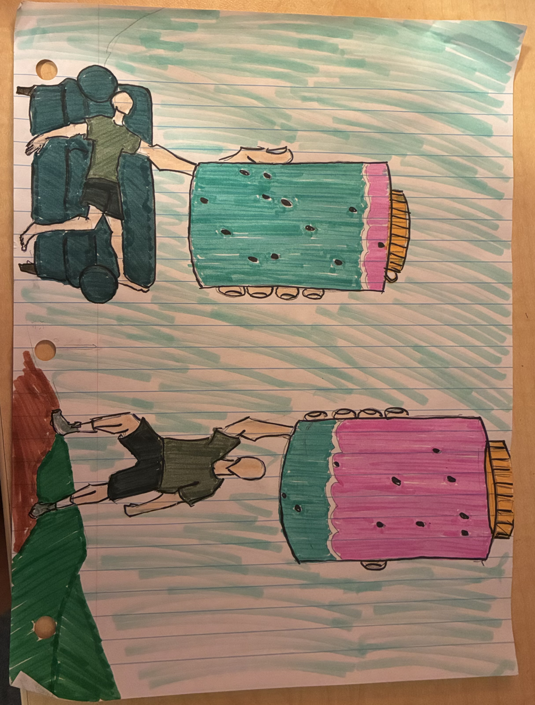

```{r}
library(tidyverse) 
library(janitor)
library(readxl)
library(ggeffects) #loading in the necessary packages for the homework assignment
```

```{r}
library(here) #building path from the root of my project folder

salinity <- read.csv(here("data", "salinity-pickleweed.csv")) #reading in my salinity and pickleweed data
```


## Problem 1

**a. An appropriate test**

The appropriate tests to determine the strength of the relationship between salinity and pickleweed biomass are the Pearson's correlation and Spearman rank correlation tests, telling us the significance of the effects of the predictor variable of salinity (mS/cm) on response variable pickleweed biomass (g). Pearson's correlation is to be used if there is a linear relationship between the variables, variables are continuous, variables are normally distributed, and there are independent observations. Spearman rank correlation is to be used if there is a monotonic relationship between variables and there are independent observations.

**b. Create visualization**

```{r}
salinity_lm <- lm( #creating an object called salinity_lm based on my linear model fit
                  pickleweed ~ salinity_mS_cm, #using pickleweed biomass as the response and salinity as the predictor variables
                  data = salinity) #using the salinity object as my data
```

```{r}
salinity_preds <- ggpredict( #creating an object called salinity_preds based on the ggpredict function, which visualizes predictions from the multiple regression models
  salinity_lm, #using the salinity_lm object as my data
  terms = "salinity_mS_cm" #going off of the salinity values
)

salinity_preds #displaying results
```

```{r}
ggplot(data = salinity, #creating a ggplot based on the salinity data
       aes(x = salinity_mS_cm,
           y = pickleweed)) + #x-axis shows the salinity values, y-axis shows the pickleweed biomass
  geom_point(fill = "tomato",
             shape = 22) + #adding points to the plot to represent observations, making them red and squares
  geom_ribbon(data = salinity_preds, #adding a ribbon to visually represent the predictions of my multiple regression models
              aes(x = x, #x-axis is the x values
                  y = predicted, #y-axis is the predicted values
                  ymin = conf.low, #y-min is the low-end of the confidence interval
                  ymax = conf.high, #y-max is the high-end of the confidence interval
                  alpha = 0.1)) + #changing the transparency value
  geom_line(data = salinity_preds, #adding in an equation line for my linear regression model
            aes(x = x, #x-axis is the x values
                y = predicted), #y-axis is the predicted values
            color = "blue") + #making the line blue
  theme_classic() + #changing the theme to get rid of background noise (gridlines and color)
  labs(x = "Salinity (mS/cm)", #labeling the x-axis
       y = "Pickleweed biomass (g)", #labeling the y-axis
       title = "Pickleweed Biomass Depending on Salinity Levels") #creating a title
```

**c. Check your assumptions and run your test**

Check assumptions

```{r}
par(mfrow = c(2,2))
plot(salinity_lm) #rendering my diagnostic plots for the salinity_lm data with 2 rows of 2
```

Above, I created plots for residuals vs. fitted and scale-location to check the homoscedasticity of the observations, and because the red line is relatively straight it would suggest that the relationship between variables is linear. The Q-Q Residuals plot tells us whether there is normal distribution with the observations, and looking at this plot there is not significant deviation from the line and we can determine that there is normal distribution. Looking at the salinity data, the variables are continuous and the individual pickleweed plants are individual observations, which in conjunction with the above assumptions tells us that we can use Pearson's correlation.

Run your test

```{r}
cor.test(salinity$salinity_mS_cm, 
         salinity$pickleweed,
         method = "pearson") #running a Pearson's correlation test for the salinity data, with salinity as the predictor and pickleweed biomass as the response variables
```

The Pearson's correlation test gives us a correlation value of 0.53.

**d. Results communication**

To evaluate the strength of the relationship between pickleweed biomass and soil salinity, I used a Pearson's correlation test and found that there is a moderate relationship (Pearson's r = 0.53, t(21) = 2.90, p = 0.0086, $\alpha$ = 0.05).

**e. Test implications**

There is a moderate relationship between salinity and pickleweed biomass, which means that there is a noticeable influence of salinity (mS/cm) on pickleweed biomass (g). Based on the results of our test, increasing salinity will lead to more success in pickleweed planting at our restoration site. However, I would note that we do not have any observations exceeding a salinity value of 10.0 mS/cm, and I don't know how surpassing this threshold would affect growth.

**f. Double check your own work**

```{r}
cor.test(salinity$salinity_mS_cm,
         salinity$pickleweed,
         method = "spearman") #running a Spearman correlation test for the salinity data, with salinity as the predictor and pickleweed biomass as the response variables
```

This test would lead me to make the same decision about the null hypothesis, despite the assumptions for both test being different and this technically being the incorrect one. They give a very similar value for the strength of the relationship, which would lead me to the same conclusion in both cases.

We found a moderate relationship between salinity (mS/cm) and pickleweed biomass (g) (Spearman $\rho$ = 0.59, S = 824, p = 0.0034, $\alpha$ = 0.05).

## Problem 2. Personal data

**a. Updating your visualizations**

```{r}
library(here) #building path from the root of my project folder

personal <- read_xlsx(here("data/Data_Project_Water_Idea_HW3.xlsx")) #reading in my data for my personal project
```

```{r}
personal_clean <- personal |> #creating a new object named personal_clean based on the personal data
  clean_names() #cleaning names to only have lower case and underscores
```

```{r}
ggplot(data = personal_clean, #creating a ggplot based on the personal_clean data
       aes(x = high_daily_temperature_f, #x-axis represents the high daily temperature in farenheit
           y = water_drank_l)) + #y-axis represents water drank in liters
  geom_jitter(height = 0, #making it a jitter plot with zero vertical jitter
              width = 0.3, #horizontal jitter is a value of 0.3
              color = "tomato") + #making the points red
  labs(x = "High Daily Temperature (Farenheit)", #labeling the x-axis
       y = "Water Drank (liters)", #labeling the y-axis
       title = "Water Drank Based on High Daily Temperature", #creating a title
       subtitle = "Most Recent Observation: 03-04-2026") + #creating a subtitle
  theme_classic() #changing the theme to classic and getting rid of visual clutter
```

```{r}
ggplot(data = personal_clean, #creating a ggplot based on the personal_clean data
       aes(x = exercised, #x-axis represents exercise categories
           y = water_drank_l, #y-axis represents water drank in liters
           color = exercised)) + #color is dependent on which exercise category you're under
  geom_jitter(height = 0, #making it a jitter plot with zero vertical jitter
              width = 0.3) + #horizontal jitter value is 0.3
  scale_color_manual(values = c("red", "blue")) + #changing colors from default
  labs(x = "Exercised (Yes/No)", #labeling the x-axis
       y = "Water Drank (liters)", #labeling the y-axis
       title = "Water Drank Based on Exercise",   #creating a title
       subtitle = "Most Recent Observation: 03-04-2026") + #creating a subtitle
  theme_classic() + #changing the theme to classic and getting rid of visual clutter
  theme(legend.position = "none") #getting rid of the legend
```

**b. Captions**

Figure 1: Scatter plot representing the water drank (L) dependent on the high daily temperature (F°). The predictor variable on the x-axis is the high daily temperature, with the response variable on the y-axis being the water drank. Each red dot represents an individual observation for a specific date. Looking at the spread of data, it does not look like there's a strong relationship between the two variables.

Figure 2: Jitter plot representing water drank (L) dependent on whether I exercised that day or not (Yes/No). The predictor variable on the x-axis is exercise, and the response variable on the y-axis is water drank. Each red dot represents an individual observation for a day that I did not exercise, and each blue dot represents an individual observation for a day that I did exercise. Looking at the plot, it would seem more water is consumed on days that I exercised.

##Problem 3. Affective visualization

**a. Describe in words what an affective visualization could look like for my personal data**

An affective visualization for my data should be centered around the idea of water being consumed. I was thinking that I could represent water drank in a water bottle. I want to do the exercise/no exercise because I feel like there is more of a relationship to explore there and I can have some fun with the visual representations for the two categories. I want it to be colorful and use identifiable imagery.

**b. Create a sketch of your idea**


**c. Make a draft of your visualization**



**d. Write an artist statement**

I am showing the relationship between the predictor variable of whether I exercised that day or not, and the response variable of how much water I drank in L. I took influence from the paintings of Jill Pelto, along with the "Dear Data" project of Stefanie Posavec and Giorgia Lupi. The form of my work is through a pen and marker drawing. I created this work by beginning with a pencil sketch, then finalizing my pencil line work, and finally filling in with marker and outlining in black.

**e. Prepared materials for class**

I have prepared slides to give an overview of my affective visualization.

[View](https://docs.google.com/presentation/d/1pu7ZRzPmM9qGvmD8HjZWTgp03hyWCaLvJaji3QshfNw/edit?usp=sharing)


## Problem 4. Statistical critique

**a. Revisit and summarize**

The statistical test that is included in this paper is the ANOVA test. Multiple tests were performed, with each one using the predictor variables of control (controlled laboratory environment), temperature, CO2, and temperature x CO2. The response variables observed are hatching time (days), food consumption rate (grams food/shark/day), and the mean growth rates (slope of biomass) over time for laboratory sharks fed ad libidum and sharks raised in natural mesocosms? The ANOVA test addresses these questions by evaluating whether the means of the groups are different from each other. In regards to this study, the ANOVA test is being performed with the purpose of seeing the difference in how select predictor variables affect shark behaviors. The ANOVA uses the F-ratio, which is the ratio of variances between groups to the variance within groups, with a larger F stat suggesting more variation. The F-ratio is evaluated with a p-value, using a significance level of 0.05, meaning that a p-value less than 0.05 is enough to determine that there is a significant difference between the means of groups. It does not tell us which groups are different, but it tells us that there is a difference.

**b. Visual clarity**

The authors do a good job at clearly representing their statistics in their figures. The x-axis is labelled with the predictor variables, and the y-axis is labelled with the response variable that's being measured. The summary statistics are shown through the bins, as the top of the bin ends at the mean, while the error bars represent SE. There is no visual representation for underlying data.

**c. Aesthetic clarity**

I think that the authors did a good job at handling visual clutter. It feels like it is only presenting the necessary information to understand the results of the ANOVA test. The ink:data ratio is good, as I understand everything without being overwhelmed.

**d. Recommendations**

One thing that I would like to see is a title that tells us what is going on in the figure, as it would help contextualize the data. Another thing that would be helpful for the reader is units on the x-axis. Something that I think might be helpful is changing colors for the bins to where the ones that do not vary from each other are the same color, so then we can see which groups are different in regards to the results of the ANOVA.
